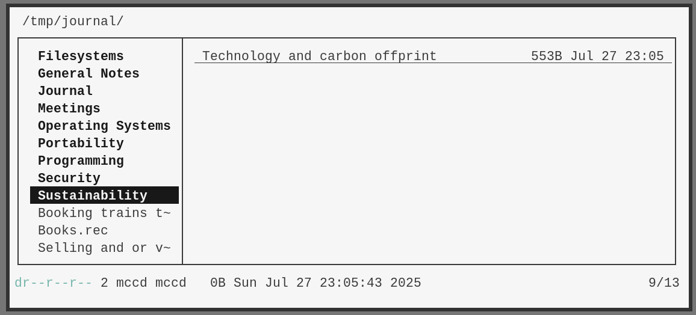

# agendafs

[Homepage](https://agendafs.website)
| [Todo](https://todo.sr.ht/~marcc/agendafs)
| [Mailing List + Patches](https://lists.sr.ht/~marcc/agendafs)



Agendafs is a FUSE-based filesystem for writing notes. It creates a shim over [vdir storages](https://pimutils.org/specs/vdir/), allowing you to write notes as regular files and synchronize them back to a caldav server. It supports directories, categories, arbitrary metadata and access rights.

## Status

Agendafs is still in early development and is alpha-level software. It
probably leaks memory, destroys files and might summon demons. However, I
use it daily for my note-taking mostly without issues. If you try it out,
I recommend creating a new calendar specifically for agendafs and also
regularly backing up your notes elsewhere.

## Installation

Prerequisites: scdoc (man pages), C compiler (currently only tested with
gcc), libfuse, libuuid, libical and pkg-config. Optionally a `shell.nix`
exists which sets up all dependencies for you.

Some fields, such as categories, are accessed via xattributes (xattr(7)), for that you will need to have the xattribute utilities installed.

You also need to setup a tool that syncs vdir storages to a caldav server, like
[vdirsyncer](https://vdirsyncer.pimutils.org/en/stable/when.html#) or [pimsync](https://sr.ht/~whynothugo/pimsync/).

To build:

```
git clone https://sr.ht/~marcc/agendafs/
cd agendafs
make
make install
```

## Basic Principles

Agendafs uses a [vdir storage](https://pimutils.org/specs/vdir/) as a backend
to allow users to sync VJOURNAL entries to a remote caldav server.

Agendafs scans the vdir directory for VJOURNAL entries to populate the
file tree. Each VJOURNAL entry is represented as a file or directory in
Agendafs. Edit these files like you would on a regular filesystem. Some
VJOURNAL attributes can also be accessed via xattr(7), for example categories
a.k.a. tags. The full list of supported user attributes can be found in the
manpage. 

Agendafs pairs well with file explorers like `ranger`, `lf` or `nnn`.

## Usage

To mount a vdir storage with Agendafs:

```
mount.agendafs -o vdir=<vdir directory> <mountpoint>
```

See [agendafs(8)](https://git.sr.ht/~marcc/agendafs/blob/main/agendafs.8.scd) and [agendafs-examples(7)](https://git.sr.ht/~marcc/agendafs/blob/main/agendafs-examples.7.scd) for a full list of options and examples.


### Limitations

Some major features are missing before a beta release:

- [Attachment support is missing](https://todo.sr.ht/~marcc/agendafs/2)
- [Symlink support is missing](https://todo.sr.ht/~marcc/agendafs/11)

Depending on the caldav server, there might be limitations as to how big
a file can be. Usually the limit of one entry is ~5MB, but agendafs does
currently not enforce any file size limit.

## Motivation

Note-taking tools like Obsidian and Logseq have great syncing capabilities,
but they restrict you to only those editors. I wanted a solution that is
more Unixy, and allow me to use my favorite CLI tools. Plain-text notes
seemed like the obvious solution, but I struggled to find a good solution
for syncing and editing notes on other devices. Caldav makes for a great
place to store notes, since many already have a provider. Storing notes in
ical-format means that I can also take advantage of mobile apps for editing
my notes, such as jtx Board on Android.

Agendafs also have some features that are too unergonomic on regular
filesystems. It makes full use of Xattributes to store categories,
classification (public vs private) and any other arbitrary metadata to the
file. This means that it frees you from just using one file-format while
still giving you capabilities to link notes, either via directories or
via categories (sibling linking exists in the ical spec, but this is not
supported yet). This also makes it easy to pair Agendafs  with CLI tools,
file explorers like nnn, lf, ranger and also editors like Kakoune and Neovim. For example, you could easily extend `lf` to show if a file is draft or not.
I documented in [examples] what this might look like

Of course, you can also ignore those features and just use Agendafs
as a way to just backup your [todotxt](http://todotxt.org/) or
[jrnl](https://jrnl.sh/en/stable/).

## Appendix

### VJOURNAL support in Nextcloud calendars

To have vjournal support on Nextcloud, I needed to create the calendar manually. This is probably also required if you use Fastmail.

```
curl -X MKCALENDAR \
  -u me:me \
  -H 'Content-Type: application/xml; charset=utf-8' \
  -d "<?xml version='1.0' encoding='UTF-8'?>
<mkcalendar xmlns='urn:ietf:params:xml:ns:caldav'>
  <set>
    <prop>
      <displayname xmlns='DAV:'>Journal</displayname>
      <calendar-description xmlns='urn:ietf:params:xml:ns:caldav'>Calendar with VJOURNAL support</calendar-description>
      <supported-calendar-component-set xmlns='urn:ietf:params:xml:ns:caldav'>
        <comp name='VEVENT'/>
        <comp name='VTODO'/>
        <comp name='VJOURNAL'/>
      </supported-calendar-component-set>
    </prop>
  </set>
</mkcalendar>" \
  'https://my-nextcloud-server/remote.php/dav/calendars/me/journal'
```

### Find files by category with nnn

Add the following function to your profile to search your notes files with a matching category.

```sh
find_by_category() {
	category=$1
	if [ -z "$category" ]; then
    		echo "Usage: find_by_category <category>" >&2
    		return 1
	fi

	find . -type f | while read -r file; do
    		fullpath=$(realpath "$file")
    		value=$(getfattr --only-values -n user.categories -- "$file" 2>/dev/null)
    		case $value in
        		*"$category"*)
            			printf '%s\0' "$fullpath"
            			;;
    		esac
    	done 
}
```

Usage: `find_by_category MY_CATEGORY | nnn`

### Why C?

I started this project to improve my C skills.

[examples]: https://git.sr.ht/~marcc/agendafs/blob/main/agendafs-examples.7.scd
